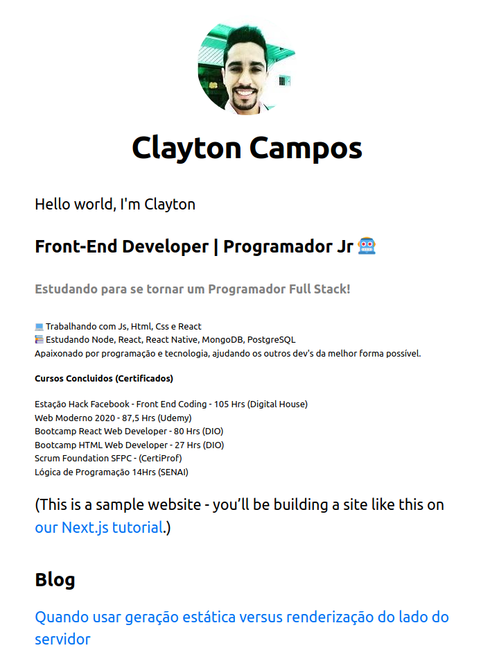

<h4 align="center" width="250px> 
	 Simple Blog with NextJs 
</h4>

	
  
	
  
  
  

  
   

---

[Acesse o Blog](http://simple-blog-nextjs.claytoncampos.vercel.app/)

<small>Simple Blog created for NextJs studies
This is a starter template for [Learn Next.js](https://nextjs.org/learn)</small>

---

##### preview

